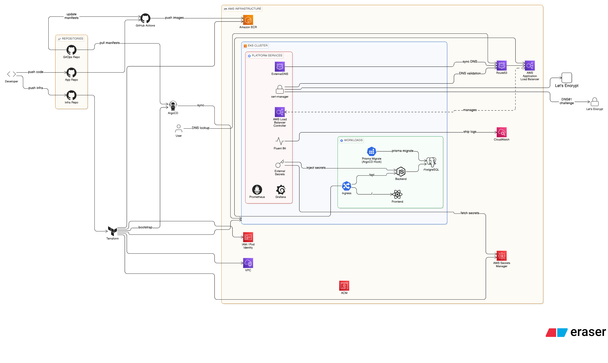
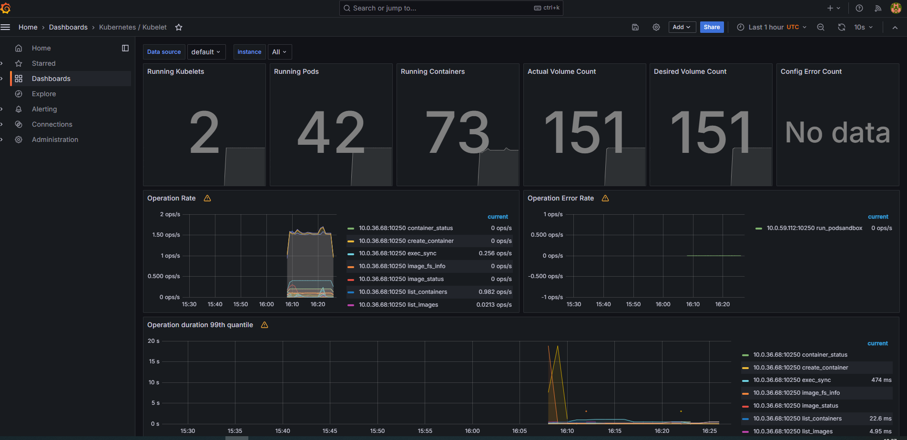

# Expense Tracker Infra

Terraform infrastructure for an ephemeral AWS/EKS production-style stack that runs the Expense Tracker platform.

This repository is the provisioning entry point for the platform layer. It creates the AWS foundation, bootstraps ArgoCD, wires GitHub OIDC for CI/CD, provisions runtime secrets, and is intentionally designed so the stack can be rebuilt from scratch with minimal manual steps.

## Visual Overview



## What This Repo Covers

- VPC, subnets, routing, and security foundations
- EKS cluster provisioning
- ECR registries for backend and frontend images
- ACM certificates
- IAM roles for GitHub Actions and Kubernetes platform services
- EKS Pod Identity associations
- AWS Secrets Manager secrets for runtime and platform auth
- CloudWatch logging target for Fluent Bit
- ArgoCD bootstrap from Terraform

## Observability Snapshot



## Design Goal

The stack is built around an ephemeral workflow:

```text
terraform apply
  -> cluster comes up
  -> ArgoCD bootstraps
  -> platform services converge
  -> app becomes reachable
terraform destroy
  -> ephemeral resources are deleted cleanly
```

Only two resources are expected to persist outside the stack:

- the S3 bucket used for Terraform remote state
- the Route53 hosted zone used by the environment

## Architecture Highlights

| Area | What It Does |
| --- | --- |
| `terraform/bootstrap` | one-time backend bucket setup |
| `terraform/environments/prod/main.tf` | VPC, EKS, ECR, ACM, IAM, storage |
| `terraform/environments/prod/argocd.tf` | ArgoCD Helm release and root app bootstrap |
| `terraform/environments/prod/secrets.tf` | Secrets Manager objects and generated credentials |
| `terraform/environments/prod/pod-identity.tf` | Pod Identity bindings for cluster services |
| `terraform/environments/prod/logging.tf` | CloudWatch log group and logging integration |
| `terraform/modules/*` | reusable modules for ECR, ACM, IAM, and GitHub OIDC |

## What Terraform Creates

| Resource Group | Details |
| --- | --- |
| Networking | VPC, public/private subnets, NAT, routing |
| Kubernetes | EKS control plane, managed node group, default storage class |
| Registry | backend/frontend ECR repositories |
| TLS | wildcard ACM certificates |
| Identity | IAM roles, Pod Identity, GitHub Actions OIDC trust |
| Secrets | GitHub App key, PostgreSQL credentials, Grafana auth placeholders |
| Logging | CloudWatch log group for container logs |
| GitOps | ArgoCD installed and pointed at the GitOps repo |

## Public-Safe Placeholders

This public repository is sanitized by design.

| Placeholder | Meaning |
| --- | --- |
| `123456789012` | sample AWS account ID |
| `YOUR_GITHUB_APP_ID` | replace with your GitHub App ID |
| `YOUR_GITHUB_APP_INSTALLATION_ID` | replace with your installation ID |
| `YOUR_GITHUB_APP_PRIVATE_KEY_HERE` | replace only in local `terraform.tfvars` |
| `203.0.113.10/32` | sample allowlist CIDR for ops endpoints |

Do not commit:

- `terraform.tfvars`
- `*.tfstate`
- AWS credentials
- kubeconfig files
- private keys
- OAuth client secrets

## Quick Start

### 1. Bootstrap remote state

```bash
cd terraform/bootstrap
terraform init
terraform apply
```

### 2. Configure the prod environment

```bash
cd ../environments/prod
cp terraform.tfvars.example terraform.tfvars
```

Populate `terraform.tfvars` with your own values before applying.

### 3. Deploy the stack

```bash
terraform init
terraform apply
aws eks update-kubeconfig --region us-east-1 --name expense-tracker-prod-cluster
```

### 4. Validate the platform

```bash
kubectl get nodes
kubectl get pods -A
kubectl get ingress -A
```

## Destroy Workflow

```bash
cd terraform/environments/prod
terraform destroy
```

Use these runbooks for the full operating flow:

- [EPHEMERAL_STACK_RUNBOOK.md](EPHEMERAL_STACK_RUNBOOK.md)
- [DESTROY_RUNBOOK.md](DESTROY_RUNBOOK.md)

## Why The Design Looks Like This

| Decision | Reason |
| --- | --- |
| Single prod stack | easier to reason about and easier to rebuild for demos |
| Ephemeral Secrets Manager resources | avoids teardown drift and long deletion windows |
| GitHub OIDC | CI/CD can assume AWS roles without static AWS keys |
| GitHub App auth for ArgoCD | repository access without PAT sprawl |
| Pod Identity | AWS permissions managed in Terraform, not spread through manifests |
| External Secrets | runtime credentials originate in Secrets Manager |
| Separate GitOps repo | application desired state stays auditable and declarative |

## Repository Structure

```text
terraform/
├── bootstrap/
│   └── main.tf
├── environments/
│   └── prod/
│       ├── argocd.tf
│       ├── logging.tf
│       ├── main.tf
│       ├── outputs.tf
│       ├── pod-identity.tf
│       ├── secrets.tf
│       ├── terraform.tfvars.example
│       └── variables.tf
└── modules/
    ├── acm/
    ├── ecr/
    ├── github-oidc/
    └── iam/
```

## Related Repositories

- [Expense-Tracker-App-Public](https://github.com/roeebronfeld/Expense-Tracker-App-Public) for the application code and GitHub Actions pipelines
- [Expense-Tracker-gitops-Public](https://github.com/roeebronfeld/Expense-Tracker-gitops-Public) for ArgoCD applications, Helm charts, and production values
